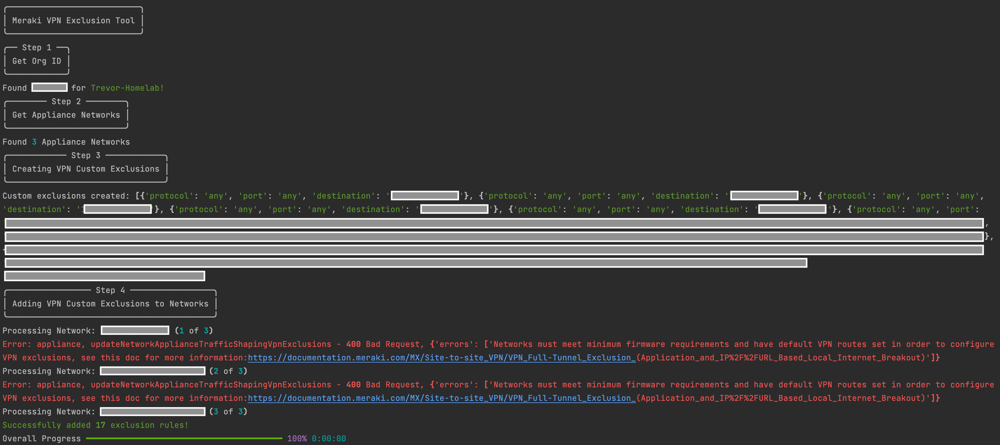

# Meraki VPN Exclusion Rule Updates

This script creates [VPN Exclusion Rules](https://documentation.meraki.com/MX/Site-to-site_VPN/VPN_Full-Tunnel_Exclusion_(Application_and_IP%2F%2FURL_Based_Local_Internet_Breakout)) for all appliance networks in an organization that are a part of a Site-to-Site VPN fabric. The rules are built from components in a CSV file and represent traffic destinations that should be routed to the local internet and not the VPN tunnels.
## Contacts
* Trevor Maco

## Solution Components
* Meraki

## Prerequisites
#### Meraki API Keys
In order to use the Meraki API, you need to enable the API for your organization first. After enabling API access, you can generate an API key. Follow these instructions to enable API access and generate an API key:
1. Login to the Meraki dashboard
2. In the left-hand menu, navigate to `Organization > Settings > Dashboard API access`
3. Click on `Enable access to the Cisco Meraki Dashboard API`
4. Go to `My Profile > API access`
5. Under API access, click on `Generate API key`
6. Save the API key in a safe place. The API key will only be shown once for security purposes, so it is very important to take note of the key then. In case you lose the key, then you have to revoke the key and a generate a new key. Moreover, there is a limit of only two API keys per profile.

> For more information on how to generate an API key, please click [here](https://developer.cisco.com/meraki/api-v1/#!authorization/authorization). 

> Note: You can add your account as Full Organization Admin to your organizations by following the instructions [here](https://documentation.meraki.com/General_Administration/Managing_Dashboard_Access/Managing_Dashboard_Administrators_and_Permissions).

#### CSV File
This script builds the VPN Exclusion rules using data from a CSV file. An example file, `vpn_exclusions-example.csv`, shows the 2 major types of rules and their formatting: `CIDR Rules`, `DNS Rules`

The available options for port and protocol can be found in the documentation, by testing in the Meraki Dashboard, or by reading the [API Documentation](https://developer.cisco.com/meraki/api/update-network-appliance-traffic-shaping-vpn-exclusions/).

## Installation/Configuration
1. Clone this repository with `git clone [repository name]`
2. Add Meraki API key and Organization name to `config.py`
```python
# Meraki API Section
API_KEY = ""
ORG_NAME = ""
```
3. Add name of CSV File with exclusions to `config.py` (please place the file in the same directory)
```python
# CSV Section
CSV_FILE = "vpn_exclusions.csv"
```
4. Set up a Python virtual environment. Make sure Python 3 is installed in your environment, and if not, you may download Python [here](https://www.python.org/downloads/). Once Python 3 is installed in your environment, you can activate the virtual environment with the instructions found [here](https://docs.python.org/3/tutorial/venv.html).
5. Install the requirements with `pip3 install -r requirements.txt`

## Usage
To run the program, use the command:
```
$ python3 main.py
```

This will read in the CSV File, create the exclusion rules, and apply them to all networks which meet the criteria to define VPN Exclusion Rules (see [docs](https://documentation.meraki.com/MX/Site-to-site_VPN/VPN_Full-Tunnel_Exclusion_(Application_and_IP%2F%2FURL_Based_Local_Internet_Breakout))). Please ensure the rules are in the proper format with valid options.





# Screenshots


### LICENSE

Provided under Cisco Sample Code License, for details see [LICENSE](LICENSE.md)

### CODE_OF_CONDUCT

Our code of conduct is available [here](CODE_OF_CONDUCT.md)

### CONTRIBUTING

See our contributing guidelines [here](CONTRIBUTING.md)

#### DISCLAIMER:
<b>Please note:</b> This script is meant for demo purposes only. All tools/ scripts in this repo are released for use "AS IS" without any warranties of any kind, including, but not limited to their installation, use, or performance. Any use of these scripts and tools is at your own risk. There is no guarantee that they have been through thorough testing in a comparable environment and we are not responsible for any damage or data loss incurred with their use.
You are responsible for reviewing and testing any scripts you run thoroughly before use in any non-testing environment.